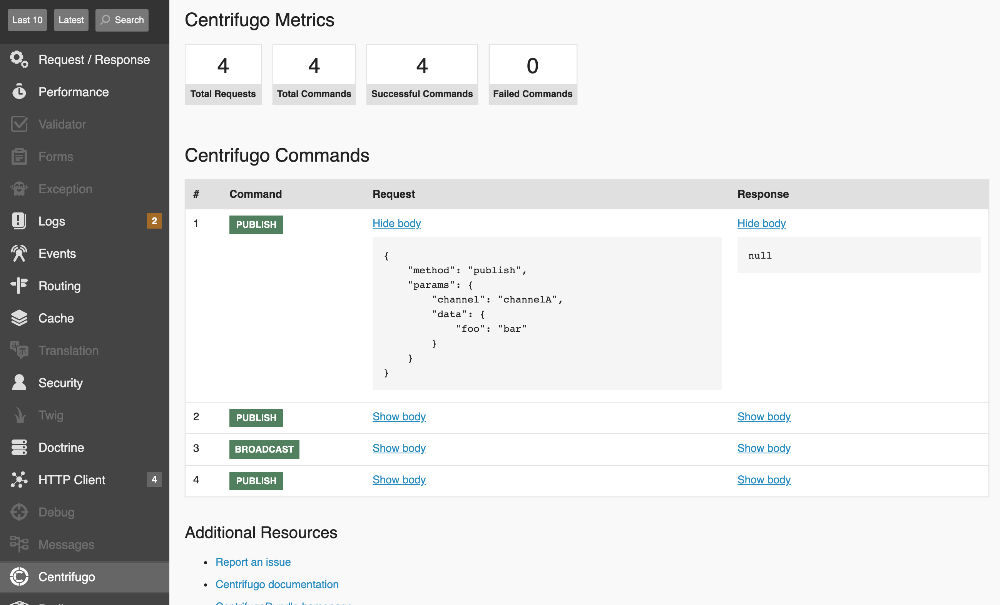

# CentrifugoBundle

📦 Provides communication with web-socket server [Centrifugo](https://centrifugal.dev) in [Symfony](https://symfony.com) applications.

[](https://scrutinizer-ci.com/g/fre5h/CentrifugoBundle/)
[](https://github.com/fre5h/CentrifugoBundle/actions?query=workflow%3ACI+branch%3Amain+)
[](https://codecov.io/github/fre5h/CentrifugoBundle)
[](https://packagist.org/packages/fresh/centrifugo-bundle)
[](https://packagist.org/packages/fresh/centrifugo-bundle)
[](https://packagist.org/packages/fresh/centrifugo-bundle)
[](https://styleci.io/repos/164834807)
[](https://gitter.im/fre5h/CentrifugoBundle)

## Features 🎁

- [x] Compatible with latest [Centrifugo 5.1.1](https://github.com/centrifugal/centrifugo/releases/tag/v5.1.1) 🚀
- [x] Wrapper over [Centrifugo HTTP API](https://centrifugal.dev/docs/server/server_api#http-api) 🔌
- [X] Authentication with JWT token (HMAC algorithm) for [anonymous](./Resources/docs/authentication.md#anonymous), [authenticated user](./Resources/docs/authentication.md#authenticated-user) and [private channel](./Resources/docs/authentication.md#private-channel) 🗝️
- [x] [Batch request](./Resources/docs/centrifugo_service_methods.md#batch-request) in [JSON streaming format](https://en.wikipedia.org/wiki/JSON_streaming) 💪
- [x] [Console commands](./Resources/docs/console_commands.md "Console commands") ⚒️️
- [x] Integration into Symfony Web-Profiler 🎛️

## Requirements 🧐

* PHP 8.2
* Symfony 6.3, 6.4, 7.0

## Installation 🌱

```bash
$ composer req fresh/centrifugo-bundle
```

By default, [Symfony Flex](https://flex.symfony.com) adds this bundle to the `config/bundles.php` file and adds required environment variables into `.env` file.
In case when you ignored `contrib-recipe` during bundle installation it would not be done. Then you have to do this manually.

#### Check the `config/bundles.php` file

```php
# config/bundles.php

return [
    // Other bundles...
    Fresh\CentrifugoBundle\FreshCentrifugoBundle::class => ['all' => true],
    // Other bundles...
];
```

#### Check the `.env` file and add you configuration

```yaml
# .env

###> fresh/centrifugo-bundle ###
CENTRIFUGO_API_KEY=secret-api-key
CENTRIFUGO_API_ENDPOINT=http://localhost:8000/api
CENTRIFUGO_SECRET=secret
###< fresh/centrifugo-bundle ###
```

`CENTRIFUGO_API_KEY` should be the same value as option `api_key` in your Centrifugo config file.  
`CENTRIFUGO_SECRET` should be the same value as option `token_hmac_secret_key` in your Centrifugo config file.

ℹ️ [Customize bundle configuration](./Resources/docs/configuration.md "Customize bundle configuration")

## Using 🧑‍🎓

### Centrifugo service

```php
<?php
declare(strict_types=1);

namespace App\Service;

use Fresh\CentrifugoBundle\Service\CentrifugoInterface;

class YourService
{
    public function __construct(private readonly CentrifugoInterface $centrifugo)
    {
    }

    public function example(): void
    {
        $this->centrifugo->publish(['foo' => 'bar'], 'channelName');
    }
}
```

ℹ️ [More examples of using Centrifugo service](./Resources/docs/centrifugo_service_methods.md "More examples of using Centrifugo service")

### Authentication with JWT tokens 🗝️

* [For anonymous](./Resources/docs/authentication.md#anonymous)
* [For authenticated User](./Resources/docs/authentication.md#authenticated-user)
* [For private channel](./Resources/docs/authentication.md#private-channel) 

### Console commands ⚒️

* `centrifugo:publish`
* `centrifugo:broadcast`
* `centrifugo:subscribe`
* `centrifugo:unsubscribe`
* `centrifugo:disconnect`
* `centrifugo:refresh`
* `centrifugo:presence`
* `centrifugo:presence-stats`
* `centrifugo:history`
* `centrifugo:history-remove`
* `centrifugo:channels`
* `centrifugo:info`

ℹ️ [More examples of using console commands](./Resources/docs/console_commands.md "More examples of using console commands")

### Integration into Symfony Web-Profiler 🎛️



### Autocomplete channels in console commands 🪄


## Contributing 🤝

Read the [CONTRIBUTING](https://github.com/fre5h/CentrifugoBundle/blob/master/.github/CONTRIBUTING.md) file.
